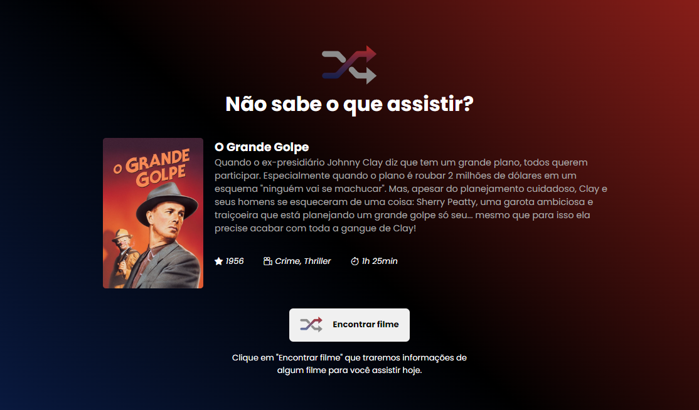

<h1 align="center">Rocketflix </h1>
<h3 align="center">Desafio Rocketflix do Discover da Rocketseat</h3>

O projeto consiste em uma página responsiva que oferece sugestões de filmes para o usuário assistir. Para isso, foi utilizada a a API do https://www.themoviedb.org/ que é um banco de dados de filmes e dados de TV criado pela comunidade.

  
  

## 🚀 Tecnologias

Esse projeto foi desenvolvido com as seguintes tecnologias:

- HTML
- CSS
- Javascript

## 💻 Projeto

- [Acesse o projeto finalizado, online (Deploy não funcional por conta da API KEY não publicada)](https://matheusbalbe.github.io/rocketflix)

---

Feito por [Matheus Balbe](https://www.linkedin.com/in/matheusbalbe)
 
Projeto baseado no desafio da [RocketSeat]
